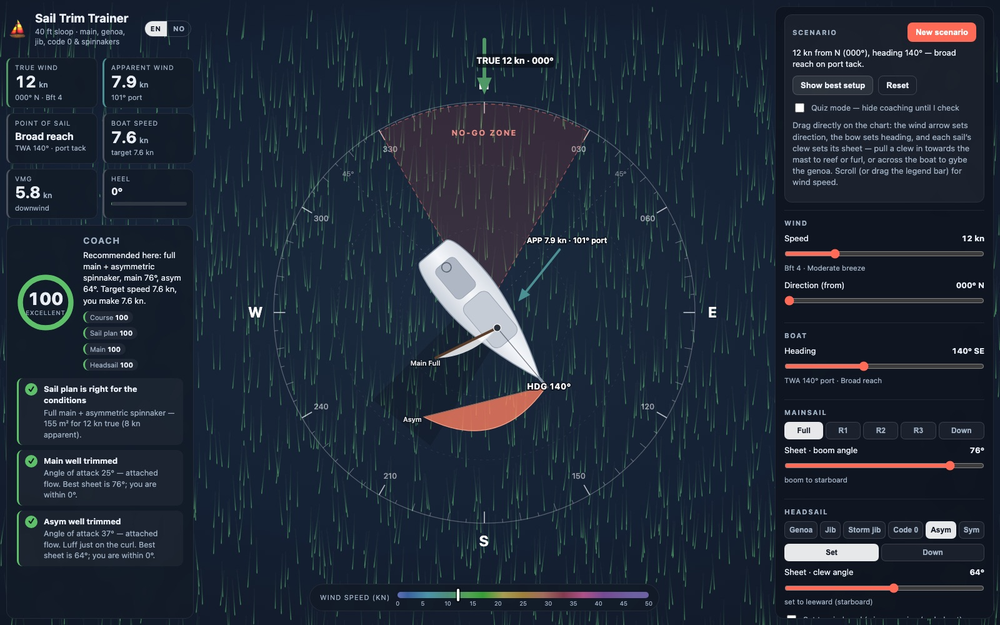

# Sail Trim Trainer ⛵

Which sails, how much of them, and how tight? Sail Trim Trainer is a top-down simulator for practising
**sail plan and trim on a 40 ft cruising sloop**. Set the wind and your heading, pick a headsail, reef, sheet,
and a coach scores the result and tells you exactly what to change, in the language you'd hear on deck.

**▶ [Try the live web app](https://icy-moss-0834b5403.3.azurestaticapps.net/)**



No framework, no build step, no dependencies: static HTML, CSS and ES modules, deployable to any static host.

## What you can practise

- **Reefing and furling**: full main and three reefs, a 135 % furling genoa in four furl states.
- **Choosing the headsail**: furling genoa, working jib, storm jib, code 0, asymmetric spinnaker and
  symmetric spinnaker on the pole. Each has its own aerodynamics, a wind-angle envelope it can fly in, and
  a wind-speed limit beyond which it becomes dangerous. Untick the sails your boat does not carry and the
  coach only recommends what you have.
- **Trim**: sheet angle for each sail (pole angle for the symmetric kite), wing-on-wing for the genoa or jib.
- **Points of sail**: the no-go zone, pinching, blanketing on a run, the accidental-gybe risk dead downwind.
- **Quiz mode** hides the coaching until you press *Check my trim*, so you can practise honestly, and
  **New scenario** deals a random wind and heading.
- **English or Norwegian (bokmål)**: the EN / NO switch in the header changes every label and all
  coaching text, including proper sailing terminology (bidevind, slør, sommerfugl, skjøte). The choice is
  remembered; `?lang=nb` in a URL forces it.

## Using it

Everything on the chart is draggable (mouse or touch); the sliders in the panel mirror it for fine
adjustment.

- **Wind**: drag the true-wind arrow around the compass for direction; scroll the wheel over the chart or
  drag the legend bar for speed.
- **Heading**: drag the bow or the hull.
- **Sheets**: drag a sail's clew. Drag the genoa across the boat to set it wing-on-wing. For the symmetric
  spinnaker, drag the pole end.
- **Reef, furl, hoist**: pull a clew in towards the mast or tack; snap rings show the reef and furl steps.
  A dropped sail leaves a dashed handle at the mast or tack, drag it outwards to hoist again.
- **Coach**: overall score plus per-item findings for course, sail plan, main and headsail. Dashed cyan lines
  on the boat show where the coach would put each sail. *Show best setup* applies the recommendation.

Keys: `←`/`→` heading, `↑`/`↓` wind, `[`/`]` main sheet, `,`/`.` headsail sheet, `n` new scenario,
`c` check. Hold `Shift` for larger steps.

Scenarios can be shared as URLs:

```
?tws=22&twd=250&hdg=300&main=r1:6&head=jib:j100:8&quiz=1
?tws=12&twd=0&hdg=140&head=asym:set:65&inv=jib,asym
```

## Run locally

```sh
npm start          # http://localhost:5173, plain Node, nothing to install
npm test           # unit tests for the sailing model
npm run test:e2e   # real pointer drags in headless Chrome (needs a local Chrome)
```

Any static server works (`python3 -m http.server`), the only requirement is HTTP rather than `file://`
because the page uses ES modules.

## What the model knows

- **Apparent wind** from true wind and boat speed, with a polar table for a modern 40 ft cruiser-racer.
- **Sail aerodynamics**: lift and drag against angle of attack, per sail type: attached flow up to a stall
  angle, a stall region, and flat-plate drag when running. Drive and side force follow from the apparent
  wind angle, so over-sheeting upwind shows up as heel without speed, and a symmetric kite is modelled as
  the pure drag device it is.
- **Trim optimum** per sail by scanning sheet angles for the best drive-minus-heel trade-off; the genoa is
  evaluated on both sides so wing-on-wing is recommended when it pays.
- **Interaction**: a leeward headsail is blanketed by the main on a run; a poled-out genoa collapses unless
  the wind is well aft; kites collapse outside their apparent-wind envelope.
- **Reefing**: nine white-sail stages from full canvas to bare poles. The recommendation is the largest plan
  whose predicted heel at optimal trim stays under ~24°, with a true-wind floor so you also reef downwind.
  On top of that the planner swaps in a proper jib or storm jib where a rag of furled genoa would set
  badly, and a code 0 or spinnaker when the angle and wind allow.
- **Feedback**: no-go zone and pinching, over- or under-canvassed, the kite that would pay, rig balance,
  luffing, soft luff, over-sheeted and stalled, blanketed, collapsing, pole too far forward or aft,
  too much wind for the sail, dead-run gybe risk.

Numbers are calibrated to be plausible for a typical 8–9 t production cruiser (45 m² main, 50 m² genoa,
110 m² asymmetric). Boats differ, so treat the recommendations as a sensible baseline, not gospel.

## Layout

```
index.html            page skeleton
styles.css            windy.com-inspired dark theme, responsive grid (desktop / mid-size / phone)
src/model.js          pure sailing model: polars, aero, headsail inventory, planner, scoring, coaching keys
src/i18n.js           English and Norwegian strings, t(), number formatting, language detection
src/scene.js          SVG top-down scene: compass, no-go wedge, wind arrows, boat, sails, drag handles
src/particles.js      animated wind particle canvas
src/palette.js        wind-speed colour scale + legend gradient
src/main.js           DOM wiring, controls, coach panel, quiz mode, URL scenarios, persistence
test/model.test.js    node --test suite for the model
test/e2e/drag.mjs     DevTools-protocol drag checks in headless Chrome
scripts/build.mjs     allowlist copy of the deployable files into dist/ for the deploy workflow
serve.mjs             zero-dependency static server
staticwebapp.config.json, .github/workflows/   Azure Static Web Apps deploy on push to main (docs-only pushes skipped)
```
